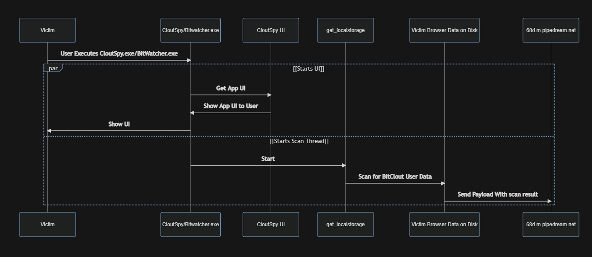
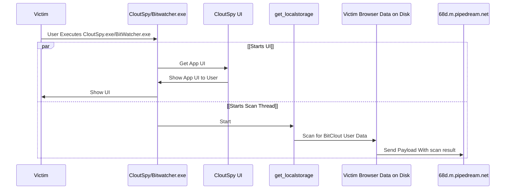

# CloutSpy and BitWatcher Security Incident - Trojan

## TOC
1. [Contributors](#Contributors)
2. [Synopsis](#Synopsis)
3. [TL;DR](#TLDR)
4. [Mechanism](#Mechanism)
5. [Decompilation](#Decompilation)
6. [IF YOU ARE AFFECTED](#IFYOUAREAFFECTED)

##  1. Contributors
* [@dgsus](https://bitclout.com/u/dgsus)
* [@tijn](https://bitclout.com/u/tijn)
* [@smartalec](https://bitclout.com/u/smartalec)
* [@automatic](https://bitclout.com/u/automatic)
* [@maebeam](https://bitclout.com/u/maebeam)
* [@HPaulson](https://bitclout.com/u/HPaulson)
* [@paulburke](https://bitclout.com/u/paulburke)
* [@Taonaya](https://bitclout.com/u/Taonaya)
* [@ItsAditya](https://bitclout.com/u/ItsAditya)
* [@Dvorkin](https://bitclout.com/u/Dvorkin)
* [@nikmcfly](https://bitclout.com/u/nikmcfly)

##  2. Synopsis 

This is a security bulletin about CloutSpy and BitWatcher. The following document will reference both of these applications as "CloutSpy/BitWatcher"

CloutSpy/BitWatcher a malicious desktop application that claims to show users various on-chain interactions between other bitclout users that one could specify. The application also **attempts to steal bitclout identity information** by scanning for browser data on the victim's hard disk, and sending them to a specific endpoint. The details of this mechanism are below.  

**If you have used CloutSpy or Bitwatcher at any time in the past, and don't care about the technical details, please [CLICK HERE](https://#)**

##  3. TL;DR

CloutSpy/BitWatcher scans your local browser's files for BitClout related login data, and upon finding stored login info, attempts to send it to an outpost server.

This means if you've ever used CloutSpy/BitWatcher on a computer that you've also logged into BitClout with, your BitClout account may have been compromised. Please go to the bottom of this page for information on how you can secure your BitClout account.

At this time, it does not appear that CloutSpy/BitWatcher continues to execute in the background after the foreground application is killed. **This note should be taken with caution**

It is to be noted that the repository's codebase itself never contained the trojan's code that was found in the binaries. May this be a reminder that the **only** way you 100% know what is running is if you examine the code, and build it yourself. There are many safe third party applications on BitClout, however one should always be very cautious with their identities in general. 

##  4. Mechanism

CloutSpy/BitWatcher claims to be an open source project on GitHub, however upon decompiling versions `2.2`, `2.1`, and `2.0` of CloutSpy, (and `2.0` of BitWatcher) one can find an attempt to read files that may contain cookies, and/or localStorage of the most popular browsers, like the Chrome/Chromium suite (Chrome, Chromium, Brave, Edge, etc), FireFox, and Opera. The application iterates through each potential browser installed on the victim's PC, and upon finding specific strings, adds them to a mass payload, and sends a payload to a specific endpoint, `https://en3mfgye4nnl68d.m.pipedream.net`

##  5. Decompilation

The single binary was created with `PyInstaller`, and was decompiled using `decompyle3`

##  6. IF YOU ARE AFFECTED

If you have ever used CloutSpy/BitWatcher in the past, it is important to follow these instructions: 

* **Delete CloutSpy.exe/BitWatcher.exe**
* Create a new BitClout Account
* Transfer all of your holdings to the new account
* Rename the previous account and reclaim your username on the new account.